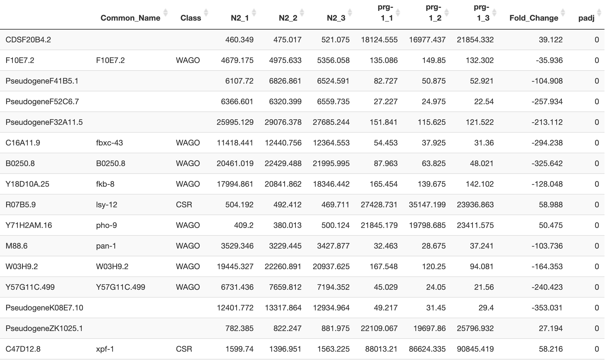
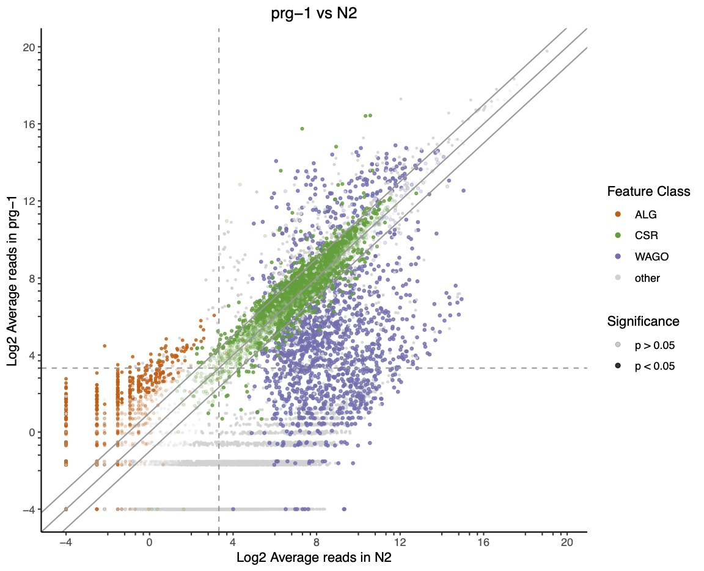
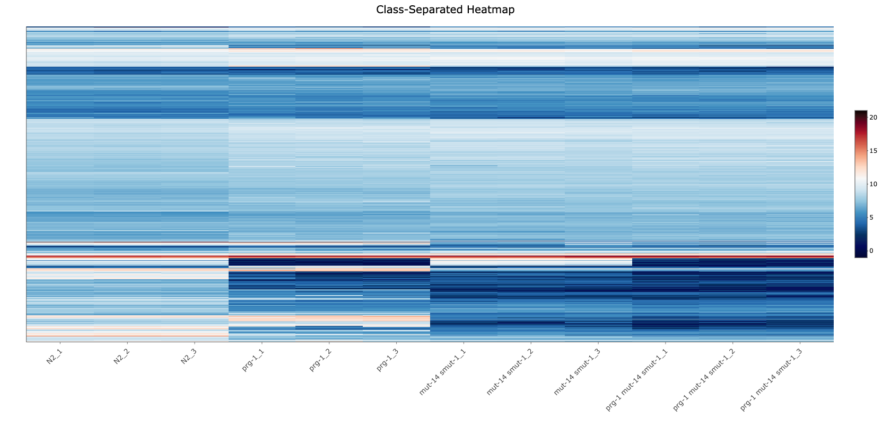
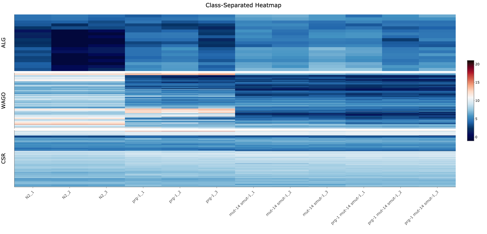

# Montgomery R Markdown Pipeline for mRNA and small RNA DGE Experiments

:warning: **Under Development & Testing** :warning:

## Table of Contents

- [Introduction](#introduction)
- [Installation](#installation)
- [Configuration Files](#configuration-files)
  - [Parameters YAML](#parameters-yaml)
  - [Metadata CSV](#metadata-csv)
  - [Gene Table](#gene-table)
  - [Plot Parameters CSV](#plot-parameters-csv)
- [Output](#output)
  - [Results Tables](#results-tables)
  - [PCA Plot](#pca-plot)
  - [Intra-Condition Scatter Plot](#intra-condition-scatter-plot)
  - [Mean Reads Scatter Plots](#mean-reads-scatter-plots)
  - [MA Plots](#ma-plots)
  - [Heatmap](#heatmap)
- [Authors](#authors)

## Introduction

Welcome to the R Markdown DESeq2 graphics pipeline by the Montgomery Lab at Colorado State University. This pipeline uses tabulated counts files from mRNA or small RNA sequencing experiments to produce differential gene expression (DGE) analysis results and visualizations. In addition to a knitted R Markdown report, the pipeline saves pdf or html files to an output folder within the local directory as well as the parameters YAML used for that experimental run.

The pipeline can be executed within R studio using the following command:

`rmarkdown::render("Montgomery_DESeq2_Pipeline.Rmd",params = yaml::read_yaml("params.yml"))`

Or in the command line as such:

`R -e 'rmarkdown::render("Montgomery_DESeq2_Pipeline.Rmd",params = yaml::read_yaml("params.yml"))'`

Execution of the pipeline can take up to several minutes depending on the complexity of the experiment and/or the level of customization. 

## Installation

This pipeline has been developed and tested with R version <strong>4.1.2</strong>. Several packages are required in order to execute the pipeline. These packages will be installed if necessary within the markdown code, but note that some packages may be difficult to install if version inconsistencies and dependency issues arise. For troubleshooting, we suggest trying to install any troublesome packages individually within R studio. We recommend using BioConductor for installing packages like <strong>tximport and DESeq2</strong>. To install a package individually, use the following command in R:

`install.packages("Package Name")`

Or use the command line as such:

`R -e 'install.packages("Package Name")'`

The following packages are used within the pipeline:

- knitr: used for knitting markdown files
  - Xie Y (2021). knitr: A General-Purpose Package for Dynamic Report Generation in R. R package version 1.37, https://yihui.org/knitr/.
- BiocManager: BioConductor package used to install tximport and DESeq2
  - Martin Morgan (2021). BiocManager: Access the Bioconductor Project Package Repository. R package version 1.30.16. https://CRAN.R-project.org/package=BiocManager
- tximport: used to format tabulated counts files into usable forms for DESeq2
  - Soneson C, Love MI, Robinson MD (2015). “Differential analyses for RNA-seq: transcript-level estimates improve gene-level inferences.” F1000Research, 4. doi: 10.12688/f1000research.7563.1.
- DESeq2: negative binomial statistical testing and data analysis for DGE experiments
  - Love, M.I., Huber, W., Anders, S. Moderated estimation of fold change and dispersion for RNA-seq data with DESeq2 Genome Biology 15(12):550 (2014)
- DT: produces HTML widgets for results tables
  - Yihui Xie, Joe Cheng and Xianying Tan (2021). DT: A Wrapper of the JavaScript Library 'DataTables'. R package version 0.20. https://CRAN.R-project.org/package=DT
- ggplot2: dynamic graphics package for PCA Plots and Mean Reads Scatter Plots
  - Hadley Wickham (2016). ggplot2: Elegant Graphics for Data Analysis. R package version 3.3.5. https://ggplot2.tidyverse.org
- heatmaply: heatmap package based on plotly, a package for producing interactive graphics
  - Tal Galili, Alan O'Callaghan, Jonathan Sidi and Carson Sievert (2017). heatmaply: an R package for creating interactive cluster heatmaps for online publishing. R package version 1.3.0. https://doi.org/10.1093/bioinformatics/btx657

## Configuration Files

### Parameters YAML

The parameters YAML file contains the details of the experimental configuration, including a number of plot customization options. The demo params.yml file can be seen here. The following parameters are read from the YAML file during the pipeline's execution:

- experiment_id: a short string with no spaces or special characters that distinguishes a particular experimental run. The experiment id will be included in the names of the output directory and saved files. 
- software_method: the tabulation software used to produce counts files or a counts matrix. Options include Counts Matrix (FeatureCounts), tiny RNA (developed by the Montgomery Lab - https://github.com/MontgomeryLab/tinyRNA), rsem, HTSeq, Salmon, Kallisto. 
- counts_matrix: a string describing the file path for the counts matrix or the tiny RNA matrix, if applicable.
- metadata: a string describing the file path for the [Metadata CSV](#metadata-csv).
- gene_table_method: options include "Full Table", "Common Names Only", "Gene Class Only", and "No Table". see [Gene Table](#gene-table).
- gene_table: a string describing the file path for the gene table, if applicable.
- generate_results_tables: TRUE or FALSE logical value describing whether [Results Tables](#results-tables) should be rendered and saved.
- generate_pca: TRUE or FALSE logical value describing whether the [PCA Plot](#pca-plot) should be rendered and saved.
- generate_intra_condition: TRUE or FALSE logical value describing whether the [Intra-Condition Scatter Plot](#intra-condition-scatter-plot) should be rendered and saved.
- generate_mean_reads: TRUE or FALSE logical value describing whether the [Mean Reads Scatter Plots](#mean-reads-scatter-plots) should be rendered and saved.
- p_value_threshold: numeric value threshold for classifying significant genes by p-value (between 0.01 and 0.1 for best results).
- fold_change_threshold: numeric value threshold for classifying significant genes by fold change (between 1.1 and 2.0 for best results).
- plot_parameters_method: options include "Full Table", "Point Colors Only", "Point Sizes Only", and "No Table". see [Plot Parameters CSV](#plot-parameters-csv).
- plot_parameters: a string describing the file path for the plot parameters csv, if applicable.
- generate_ma: TRUE or FALSE logical value describing whether the [MA Plots](#ma-plots) should be rendered and saved.
- generate_heatmap: TRUE or FALSE logical value describing whether the [Heatmap](#heatmap) should be rendered and saved.
- heatmap_type: options include "Complete", "Class-Separated: All Classes", and "Class-Separated: Selected Classes". See [Heatmap](#heatmap).
- heatmap_selected_classes: comma-separated list of classes for which heatmaps will be generated if the heatmap type is "Class-Separated: Selected Classes"

An example of the parameters YAML can be seen here.

### Metadata CSV

The metadata csv summarizes the experimental design and provides information to the DESeq2 analysis. The first column of the metadata csv should include counts file names corresponding to each sample. If the software method being used is "Counts Matrix" or "tiny RNA" then the first column can consist of either arbitrary/empty strings or name of the counts matrix repeated on each row. The second column of the metadata csv describes specific replicates for each sample in the experiment (ex. "WT_1","prg-1_2", etc.). The third column describes the condition associated with each of the samples/replicates in the previous column (ex. simply "WT" or "prg-1"). The fourth column of the csv consists of logical values (TRUE/FALSE) describing whether each sample belongs to a control group/condition. An example of the metadata csv can be viewed here.

### Gene Table

The gene table is a key component of customizing the pipeline's data analysis and visualization. The first column of the gene table should consist of any number of gene IDs identical to corresponding IDs from the counts files or matrix. If "Common Names Only" is selected as the gene table method, then common or public names should be listed in the second column of the csv. If a gene does not have a common name, its gene ID can be repeated in the second column, or the gene can be removed from the gene table altogether. If "Gene Class Only" is selected as the gene table method, then any classification of interest can be listed in the second column of the csv. If a gene has no associated classification, it should be removed from the gene table or given the classifcation "other" in the second column. If "Full Table" is selected as the gene table method, common names should be listed in the second column and classifications should be listed in the third column. If a gene does not have either a common name or a classification, the rules of the other corresponding table types should be applied. An example gene table can be viewed here.

### Plot Parameters CSV

The plot parameters csv is used to customize [Mean Reads Scatter Plots](#mean-reads-scatter-plots). A gene table must be used in the experiment in order for the plot parameters csv to be usable. The first column of the csv should consist of any number of class names identical to those found in the gene table. Points (genes) corresponding to these classes can be colored, re-sized, or both in the mean reads scatter plots. If "Point Colors Only" is selected as the plot parameters method, the second column of the table should consist of hex color values corresponding to each class (ex. "#D95F02"). If "Point Sizes Only" is selected as the plot parameters method, the second column of the table should consist of numeric values between 0.1 and 1.0 that describe the point sizes for genes of the corresponding class (default size is 0.5). If "Full Table" is selected as the plot parameters method, then the second column of the csv should consist of point colors and the third column should consist of point sizes. An example plot parameters csv can be seen here. 

## Output

### Results Tables

Results tables display the gene-wise counts from each replicate in a given contrast, followed by the fold change value of each gene and the associated p-value (adjusted) of the negative binomial hypothesis test conducted by DESeq2. Lower p-values indicate a lower probability of the null hypothesis that counts between the two conditions are derived from the same distributional parameters. Furthermore, any common gene names and/or classes from an uploaded gene table will be included in columns beside the Gene ID column. In addition to pdf outputs, these tables are rendered within the markdown file as html widgets with <strong>sorting, searching, and page size customization</strong> features.

### PCA Plot

The PCA plot displays loadings of the first two principal components for each sample/biological replicate in the experimental design. Colored by experimental condition, the points of the PCA plot provide a visualization of clustering amongst the samples, both within conditions and across conditions.

### Intra-Condition Scatter Plot

The Intra-Condition Scatter Plots display log2 counts between pairs of biological replicates within each condition of the experimental design. Any counts in the data below 1 are replaced with a value of 1 to simplify the log2 transformation. All replicate pairs in each condition are displayed.

### Mean Reads Scatter Plots

The Mean Reads Scatter Plots display average log2 counts across biological replicates of experimental condition pairs for a provided contrast. Average counts with a value of 0 are assigned the value -4 following the log2 transformation. Guidelines are added to assist with visualization. Statistically significant genes are less transparent than insignificant genes, and they are colored <strong>blue</strong> in default plots. Axes are scaled to more closely resemble the log2 transformation. Unlabeled tick marks, therefore, do not always represent whole number intervals between labeled tick marks. In addition to pdf outputs, Mean Reads Scatter Plots are rendered within the markdown file as html widgets with <strong>draggable zooming, panning, and hover text</strong> features. To reset the scatter plot axes within the widget, the <strong>home</strong> button in the top right corner of the widget can be pressed.

The mean reads scatter plots can be customized by changing the <strong>p-value</strong> and <strong>fold change</strong> thresholds for distinguishing statistically significant genes. The points of the plot can also be <strong>colored and sized</strong> according to their gene classes as specified by the <strong>gene table</strong>. If no gene table has been selected/uploaded, only the p-value and fold change thresholds will be customizable. If a gene table has been selected/uploaded, a plot parameters csv can be selected from the working directory. 

### MA Plots

The Standard MA Plots are built from the DESeq2 package and display the fold change of a gene over its mean counts value (normalized) for a provided contrast between experimental conditions. Genes with a statistically significant p-value (p < 0.05) are colored in <strong>blue</strong>.

### Heatmap

The <strong>Complete</strong> heatmap shows log2 counts across all samples for any genes above a certain mean count threshold of three (meaning an average of eight counts across all samples). Using the package <strong>heatmaply</strong>, an interactive html widget is rendered with <strong>draggable zooming, panning, and hover text</strong> features. To reset the heatmap axes, the home button in the top right corner of the widget can be pressed. Darker blue cells indicate lower log2 counts values, while darker red cells indicate higher log2 counts values. Furthermore, rows (genes) are clustered using the complete hierarchical clustering method in R (hclust) with eudclidean distances.

The <strong>Class-Separated: All Classes</strong> heatmap relies on the gene table to map all genes with an associated class. Such genes are grouped alphabetically by class and clustered hierarchically within their respective group. Hover text indicates the class assigned to each gene.

The <strong>Class-Separated: Selected Classes</strong> heatmap produces subplots for each class listed in the associated yaml parameter entry.Heatmaps for each listed class are scaled according to the limits of the complete heatmap, although cell sizes are scaled according to the number of genes associated with each class. 

## Authors

* **Dr. Taiowa Montgomery** - 05/2021-present - Colorado State University - [taimontgomery](https://github.com/taimontgomery)
* **Spencer Kuhn** - 06/2021-present - Colorado State University - [smcguirekuhn](https://github.com/smcguirekuhn)
