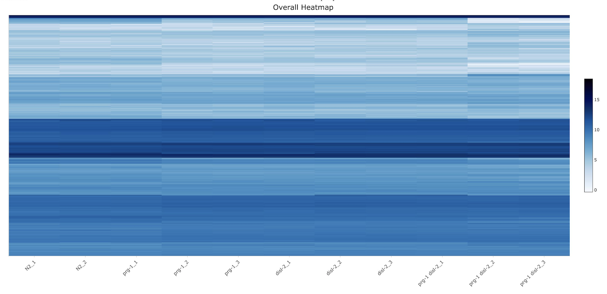
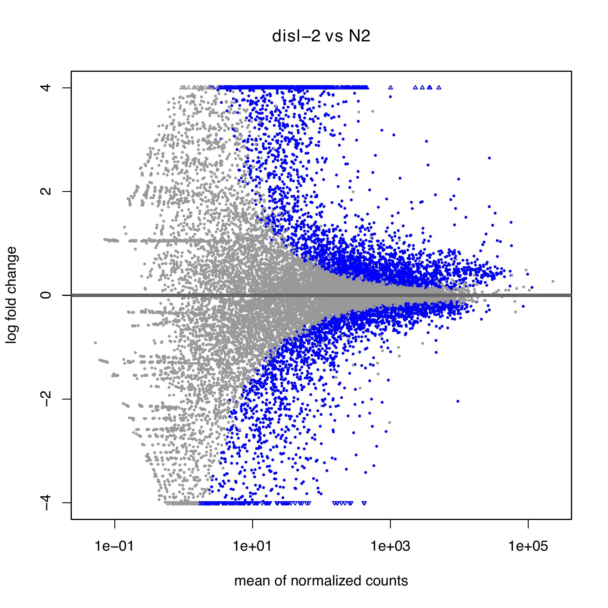
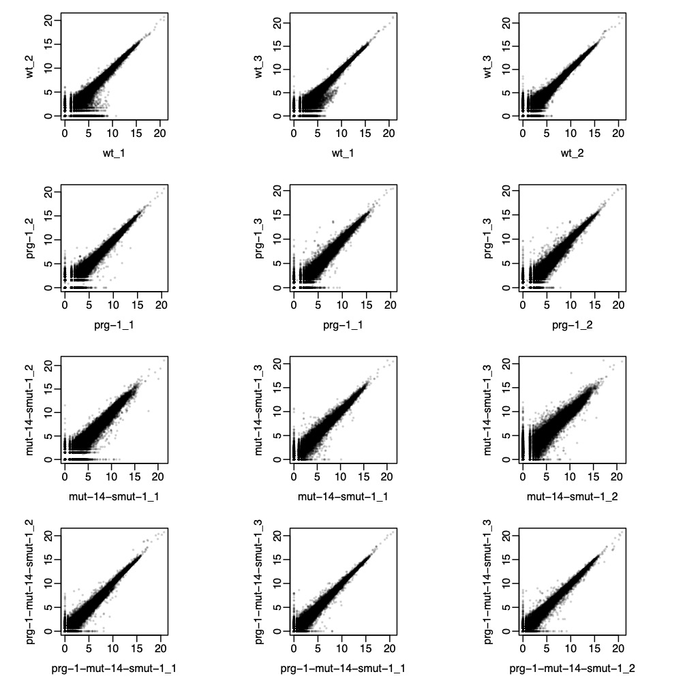
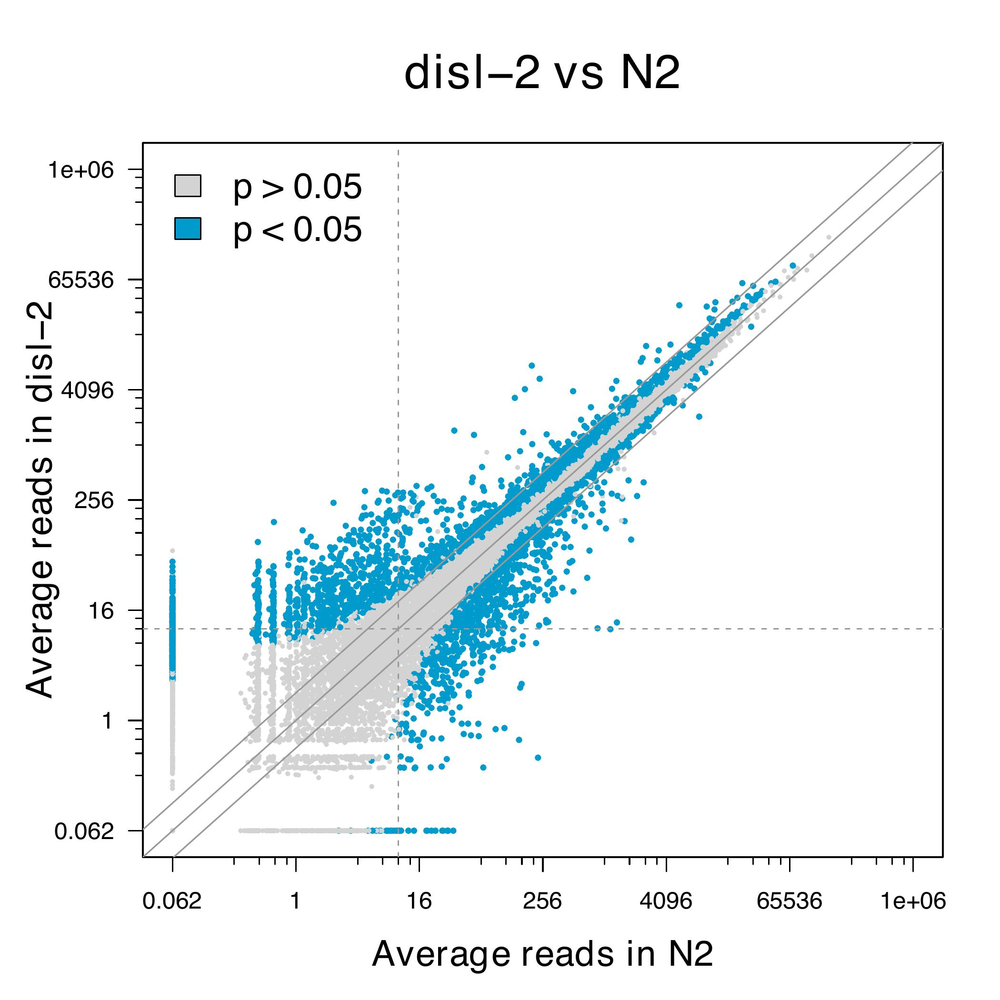

# Read Filtering, Mapping, and Feature Counting

## COMING SOON

# DESeq2 Results & Graphics Wrapping Program for mRNA Differential Gene Expression Experiments

## Table of Contents

[Introduction](#Introduction)

[CSV Interpretation, DESeq, and Wrapped Objects for Plotting](#CSV-Interpretation,-DESeq,-and-Wrapped-Objects-for-Plotting)

[PCA Plot](#PCA-Plot)

[MA Plots](#MA-Plots)

[Heatmap](#Heatmap)

[Intra-Condition Scatterplots](#Intra--Condition-Scatterplots)

[Mean Reads Scatterplots](#Mean-Reads-Scatterplots)

## Introduction

This pipeline serves to interpret DESeq2 output of mRNA DGE Experiments using a PCA plot, MA Plots for different contrasts, an overall counts heatmap, replicate scatter plots within each condition, and mean scatterplots for different contrasts that highlight statistically significant observations. Required packages are DESeq2, tximport, knitr, and heatmaply. Ensure these packages and all their dependencies are installed before proceeding. Within the working directory, seqeuncing results files from Rsem (already filtered, trimmed, and mapped to a reference genome) will need to be present in addition to a csv called 'samples.csv' with columns in the following format: "files", "replicates", "condition", and "control_condition". The first column is a list of the file names to be imported from the working directory. The second column consists of the treatment type and replicate number associated with each corresponding results file (for example, 'WT_1'). The third column consists of the generalized treatment type/condition for each file without replicate numbers (for example, simply 'WT'), and the fourth column is a logical vector (TRUE/FALSE) establishing whether or not each condition/file is a control group condition/file. The first file listed for each condition will be used to establish the control group status from the fourth column. The pipeline is generalized to a variety of experimental types. If one control group is listed, all other condition groups will be compared against the control group, with MA Plots and mean reads scatterplots drawn for each contrast between control and experimental groups. If multiple control groups are listed, or if no control group is listed, MA Plots and mean reads scatterplots will be drawn for all possible contrasts between different conditions. An example of the samples.csv file can be seen [here](ExampleData/samples.csv). 

A knitted report document for this pipeline can be created from the markdown file that compiles all graphics into a single html page, with raw code included as an appendix. To knit the report, press the knit button in RStudio at the top of the code editor window. Run time can be up to several minutes. Individual code chunks within the markdown file can also be run by pressing the green run button in the top corner of each chunk. It is best practice to run chunks in order of their appearance in the script. Several chunks are used only to generate the R Markdown report. These chunks are those with a redundant plotting call.

## CSV Interpretation, DESeq, and Wrapped Objects for Plotting

The samples table is generated from the samples.csv file in the working directory. A list of files named by their replicate number and type is created for the tximport function. The 'control_condition' object summarizes each unique condition as a control or experimental group according to a named logical vector. The DESeqDataSetFromTximport function requires a table consisting of the condition column with each row named according to the associated replicated number and type. This table is named 'sampleTable'. After tximport is run to interpret the results files, the dds object compiles the imported files and runs them through DESeq2. An overall counts table is built from dds and saved in the working directory as a csv file with a preceding date stamp. Next, the list of intended contrasts is stored in the 'Combinations' object, which is built from the information in 'control_condition'. 'Combinations' is used for the MA Plots and mean reads scatterplots. For each contrast, a counts table csv is made and saved in the working directory with a preceding date stamp. These counts tables include the counts for each replicate in the contrast, the literal fold change between contrasted conditions, and the adjusted P-Value of the fold change. In addition, if a csv file called "Gene_Table.csv" is present in the working directory, with the csv consisting of a list of GeneIDs in one column and GeneIDs or common gene names (if available) in the second column, then the counts tables will be built with a column including the common names (GeneID simply repeated if common name is not available). If "Gene_Table.csv" is not present in the working directory, the counts tables will include repeated GeneID columns. After the counts table csv files are made, a variance-stablizing transformation is performed for the PCA plot. Then, the counts table is log2 transformed and put into the object 'cts_heat', and rows with an average count below 3 (post-transformation) are removed from 'cts_heat' for heatmap preparation. This table is clustered by row using euclidean distance and complete clustering. Finally, a table is generated compiling the log2 of average counts by gene across all replicates for each condition. Infinite values are replaced with -4. This counts table is used for the mean reads scatterplots. 

## PCA Plot

The variance stabilizing transform data is used to create a plot for the first two principal components, colored by condition and formatted according to default ggplot arrangements. The output is a PDF file labeled with a preceding date stamp.

## Heatmap

The object 'cts_heat', which consists of all log2 counts from 'cts' that are above a row threshold of 3 (which translates to an average read number of 8 across all samples for a given gene), is used to create an interactive heatmap for the counts table. This heatmap is clustered by row (prior to the plotting call) using euclidean distance and a complete clustering method. Darker blue cells correspond to higher log2 counts. The heatmap includes hover text describing each cell, as well as zooming and panning features for analyzing smaller groups of cells. The output is an interactive HTML widget.

## MA Plots

For MA Plotting, a function defined within the program creates two MA Plot pdfs for a given contrast between conditions. With the two contrasting conditions as the function inputs, CompareMA generates a results file from the dds object. This results file is used for the plotMA function from DESeq2. The first pdf consists of a standard MA plot, while the second consists of an MA plot after LFC shrinkage using the lfcShrink function from DESeq2. The LFC Shrinkage is type 'normal' and takes a contrast argument rather than a coefficient argument. Output pdfs have a preceding date stamp.

Above: Standard MA Plot | Below: LFC Shrinkage MA Plot

## Intra-Condition Scatterplots

A program-defined function called scatterplot_by_condition takes the condition set factor vector as its only input. The function iterates through every condition and produces a counts scatterplot for each combination of two intra-condition replicates. For instance, if there are two conditions, A and B, and three replicates within each condition, then six total scatterplots will be produced, with the first row of plots comparing replicates 1/2, 1/3, 2/3 for condition A and the second row comparing replicates 1/2, 1/3, and 2/3 for condition B. These scatterplots are compiled into a single pdf with a preceding date stamp. 

## Mean Reads Scatterplots

The mean reads scatterplots graph average counts of all genes (across biological replicates) for one condition against the average counts for another condition according to the previous set of contrasts generated for the MA Plots. A program-defined function called mean_scatterplot takes a results object for a single contrast and distinguishes significant data points based on adjusted p-values of less than 0.05 and a log2 fold change greater than 0.378511623 or less than -0.378511623. The scatterplot function then colors the average counts by gene based on these significance qualifications, with blue points corresponding to significant data points and gray points corresponding to insignificant data points (named colors in R are used), although point colors can be changed within the Plot_Colors object. Diagonal guide lines are added with intercepts -1, 0, and 1. Axes are on a log2 scale, with four minor tick marks spaced at even numeric intervals between each major tick mark. Vertical and horizontal axes both range from 1/16 to 1,048,576, with each major tick mark representing a sixteen-fold increase from the previous tick mark. The output PDF files are labeled by contrast with a preceding date stamp. 

## Authors

* **Dr. Taiowa Montgomery** - 05/2021-present - Colorado State University - [taimontgomery](https://github.com/taimontgomery)
* **Spencer Kuhn** - 06/2021-present - Colorado State University - [smcguirekuhn](https://github.com/smcguirekuhn)
